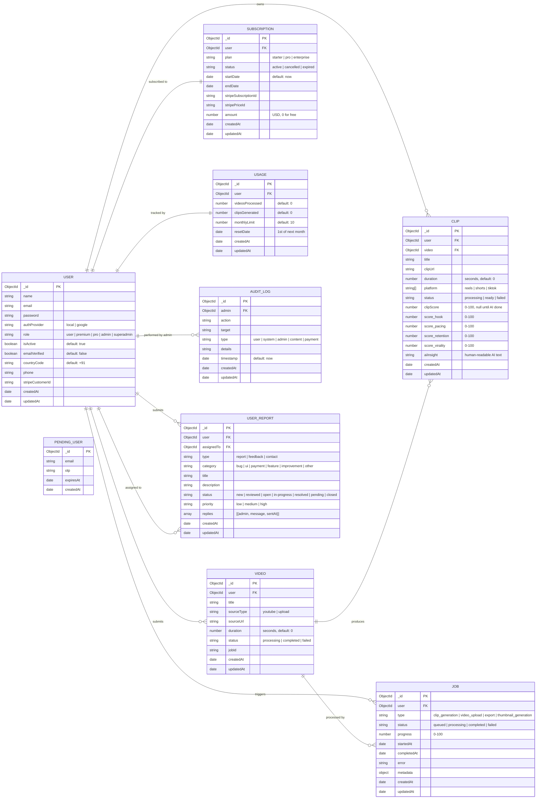
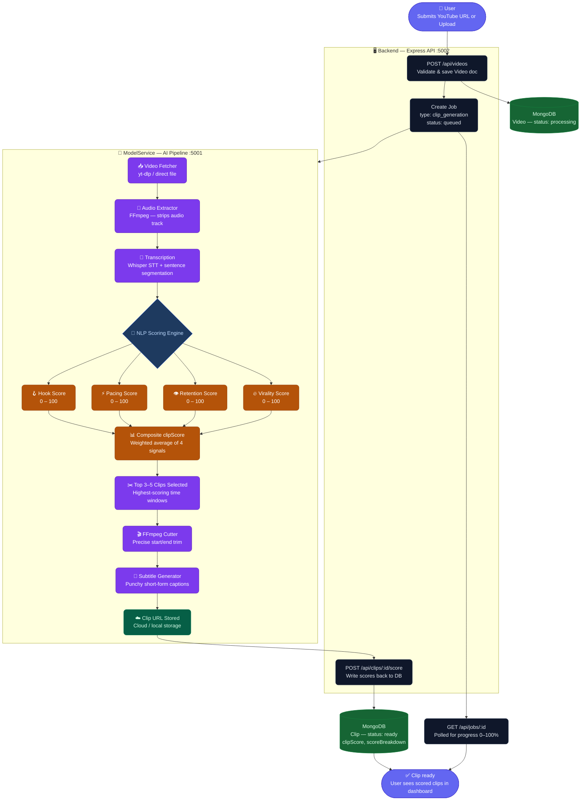

# ✂️ Clipperzz

> **An AI-powered short-form content intelligence platform** that takes long-form videos (YouTube, podcasts, interviews) and automatically extracts high-potential clips — scored by hook strength, pacing, virality, and retention — ready for Reels, Shorts, and TikTok.


---

## 📋 Table of Contents

- [Overview](#-overview)
- [Architecture](#-architecture)
- [Tech Stack](#-tech-stack)
- [AI Pipeline](#-ai-pipeline)
- [Backend API](#-backend-api)
- [Data Models](#-data-models-9-total)
- [Getting Started](#-getting-started)
- [Environment Variables](#-environment-variables)
- [ER Diagrams](#-er-diagrams)
- [Contributors](#-contributors)

---

## 🎯 Overview

Clipperzz is a **full-stack monorepo platform** consisting of three services that work together:

| Component | Purpose |
|-----------|---------|
| **Frontend** | React web app — landing page, user dashboard, admin panel |
| **Backend** | Express REST API — auth, clips, jobs, subscriptions, payments |
| **ModelService** | AI/ML service — video transcription, clip scoring, generation |

### Key Features

- 🎬 **Video Ingestion** — Submit YouTube URLs or upload videos directly
- 🤖 **AI Clip Scoring** — Every clip is scored on Hook, Pacing, Virality, and Retention (0–100)
- ✂️ **Auto Clip Generation** — FFmpeg-powered extraction of the highest-scoring moments
- 📝 **Subtitle Generation** — Short-form optimised, punchy auto-captions
- 💳 **Subscription & Billing** — Stripe-integrated Starter / Pro / Enterprise plans
- 📊 **Usage Tracking** — Per-user monthly limits tracked and enforced
- 🔐 **Role-based Auth** — User, Premium, Pro, Admin, SuperAdmin roles
- 🔑 **Google OAuth** — One-click sign-in via Google
- 📬 **Email & SMS** — OTP verification via Nodemailer + Twilio
- 🛡️ **Admin Dashboard** — Full user management, audit logs, report triage
- 📋 **User Reports** — In-app bug reports, feedback, and contact forms

---

## 🏗️ Architecture

```
┌───────────────────────────────────────────────────────────────┐
│                         FRONTEND                              │
│           React 19 + Vite 7 + Tailwind CSS 4                 │
│                                                               │
│  Landing Page  │  User Dashboard  │  Admin Dashboard          │
└───────────────────────────┬───────────────────────────────────┘
                            │  HTTP / REST
                            ▼
┌───────────────────────────────────────────────────────────────┐
│                       BACKEND API                             │
│              Express 5 + Node.js (ESM, port 5002)            │
│                                                               │
│  Auth  │  Videos  │  Clips  │  Jobs  │  Stripe  │  Reports   │
└──────────────┬──────────────────────────────┬─────────────────┘
               │                              │
               ▼                              ▼
┌──────────────────────┐        ┌─────────────────────────────┐
│       MongoDB        │        │       ModelService           │
│  (Mongoose ODM)      │        │  AI/ML Processing (port 5001)│
│                      │        │                              │
│  Users, Videos,      │        │  Whisper Transcription       │
│  Clips, Jobs,        │        │  NLP Segment Scoring         │
│  Subscriptions,      │        │  FFmpeg Clip Generation      │
│  Usage, AuditLogs,   │        │  Subtitle Generation         │
│  UserReports,        │        │                              │
│  PendingUsers        │        └─────────────────────────────┘
└──────────────────────┘
```

---

## 🛠️ Tech Stack

### Backend (`Backend/`)

| Technology | Version | Purpose |
|------------|---------|---------|
| **Express.js** | ^5.2.1 | REST API framework |
| **MongoDB + Mongoose** | ^9.3.1 | NoSQL database + ODM |
| **bcryptjs** | ^3.0.3 | Password hashing |
| **jsonwebtoken** | ^9.0.3 | JWT authentication |
| **google-auth-library** | ^10.6.2 | Google OAuth verification |
| **Stripe** | ^22.0.1 | Payment processing & webhooks |
| **Nodemailer** | ^8.0.4 | Email OTP & notifications |
| **Twilio** | ^5.13.1 | SMS OTP verification |
| **nodemon** | ^3.1.14 | Dev auto-reload |

### Frontend (`Frontend/`)

| Technology | Version | Purpose |
|------------|---------|---------|
| **React** | ^19.2.0 | UI library |
| **Vite** | ^7.2.4 | Build tool & dev server |
| **Tailwind CSS** | ^4.1.18 | Utility-first styling |
| **React Router DOM** | ^7.12.0 | Client-side routing |
| **Axios** | ^1.14.0 | HTTP client |
| **Lucide React** | ^0.563.0 | Icon library |
| **Radix UI** | ^1.2.4 | Accessible UI primitives |

### ModelService (`ModelService/`)

| Technology | Purpose |
|------------|---------|
| **Whisper / STT** | Speech-to-text transcription |
| **NLP Scoring Engine** | Hook, Pacing, Virality, Retention analysis |
| **FFmpeg** | Video slicing and clip generation |
| **Subtitle Generator** | Short-form optimised caption creation |

---


## 🤖 AI Pipeline

The ModelService handles all compute-heavy video intelligence. It is called by the Backend after a video job is queued.

### Pipeline Flow

```
User submits YouTube URL or Video Upload
          │
          ▼
  ┌───────────────────┐
  │   Video Fetcher   │  ← yt-dlp / direct upload
  │  Metadata fetch   │
  └────────┬──────────┘
           │
           ▼
  ┌───────────────────┐
  │ Audio Extraction  │  ← FFmpeg strips audio track
  └────────┬──────────┘
           │
           ▼
  ┌───────────────────┐
  │  Transcription    │  ← Whisper speech-to-text
  │  + Segmentation   │    Sentence & boundary detection
  └────────┬──────────┘
           │
           ▼
  ┌─────────────────────────────────────┐
  │        NLP Scoring Engine           │
  │                                     │
  │  Hook Score    (0–100)              │
  │  Pacing Score  (0–100)              │
  │  Retention     (0–100)              │
  │  Virality      (0–100)              │
  │  AI Insight text                    │
  └────────┬────────────────────────────┘
           │
           ▼
  ┌───────────────────┐
  │  Clip Selection   │  ← Top 3–5 segments selected
  │  (Start / End)    │
  └────────┬──────────┘
           │
           ▼
  ┌───────────────────┐
  │   FFmpeg Cutter   │  ← Precise video trimming
  └────────┬──────────┘
           │
           ▼
  ┌───────────────────┐
  │ Subtitle Generator│  ← Punchy short-form captions
  └────────┬──────────┘
           │
           ▼
  PATCH /api/clips/:id/score  ← Scores written back to Backend DB
          │
          ▼
  Clip ready for user preview & download
```

### Clip Score Breakdown

| Signal | Description |
|--------|-------------|
| **Hook** | Strength of the opening seconds — does it grab attention? |
| **Pacing** | Speed of speech, cut rhythm, information flow |
| **Retention** | Predicted watch-through likelihood |
| **Virality** | Presence of contrast, questions, shock, clarity, humour |
| **clipScore** | Weighted composite of all four (0–100) |

---

## 🔌 Backend API

### Available Routes

| Method | Route | Auth | Description |
|--------|-------|------|-------------|
| `POST` | `/api/auth/register` | Public | Register with email + OTP |
| `POST` | `/api/auth/login` | Public | Login, returns JWT |
| `POST` | `/api/auth/google` | Public | Google OAuth sign-in |
| `POST` | `/api/auth/verify-otp` | Public | Verify email OTP |
| `POST` | `/api/auth/resend-otp` | Public | Resend email OTP |
| `GET` | `/api/users/me` | User | Get current user profile |
| `PUT` | `/api/users/me` | User | Update profile |
| `GET` | `/api/videos` | User | List user's videos |
| `POST` | `/api/videos` | User | Submit YouTube URL / upload |
| `GET` | `/api/videos/:id` | User | Get video with clips |
| `DELETE` | `/api/videos/:id` | User | Delete video |
| `GET` | `/api/clips` | User | List user's clips |
| `POST` | `/api/clips` | User | Create clip manually |
| `GET` | `/api/clips/:id` | User | Get clip details & score |
| `PUT` | `/api/clips/:id` | User | Update clip metadata |
| `DELETE` | `/api/clips/:id` | User | Delete clip |
| `GET` | `/api/clips/stats` | User | Clip statistics summary |
| `PATCH` | `/api/clips/:id/score` | Admin | Write AI score from ModelService |
| `GET` | `/api/jobs` | User | List background jobs |
| `GET` | `/api/jobs/:id` | User | Get job progress |
| `GET` | `/api/subscriptions/me` | User | Get current plan |
| `POST` | `/api/stripe/checkout` | User | Create Stripe checkout session |
| `POST` | `/api/stripe/webhook` | Public | Stripe event webhook (raw body) |
| `GET` | `/api/stripe/portal` | User | Stripe billing portal |
| `GET` | `/api/usage/me` | User | Get monthly usage & limits |
| `GET` | `/api/logs` | Admin | List audit logs |
| `GET` | `/api/reports` | User | List submitted reports |
| `POST` | `/api/reports` | User | Submit bug report / feedback |

---

## 🗄️ Data Models (9 Total)

### Core Models

| Model | Key Fields |
|-------|-----------|
| **User** | name, email, password, authProvider (local/google), role (user/premium/pro/admin/superadmin), stripeCustomerId, emailVerified, phone |
| **PendingUser** | email, otp, expiresAt — holds unverified registrations |
| **Video** | user (ref), title, sourceType (youtube/upload), sourceUrl, duration, status (processing/completed/failed), jobId |
| **Clip** | user (ref), video (ref), title, clipUrl, duration, platform (reels/shorts/tiktok), status, clipScore (0-100), scoreBreakdown {hook, pacing, retention, virality}, aiInsight |
| **Job** | user (ref), type (clip_generation/video_upload/export/thumbnail_generation), status (queued/processing/completed/failed), progress (0-100), startedAt, completedAt, error, metadata |

### Billing Models

| Model | Key Fields |
|-------|-----------|
| **Subscription** | user (ref), plan (starter/pro/enterprise), status (active/cancelled/expired), startDate, endDate, stripeSubscriptionId, stripePriceId, amount |
| **Usage** | user (ref), videosProcessed, clipsGenerated, monthlyLimit, resetDate |

### Admin & Audit Models

| Model | Key Fields |
|-------|-----------|
| **AuditLog** | admin (ref), action, target, type (user/system/admin/content/payment), details, timestamp |
| **UserReport** | user (ref), type (report/feedback/contact), category (bug/ui/payment/feature/other), title, description, status, priority, assignedTo (ref), replies [{admin, message, sentAt}] |

---

## 🚀 Getting Started

### Prerequisites

Make sure the following are installed before you begin:

| Tool | Version | Install |
|------|---------|---------|
| **Node.js** | ≥ 18.x | [nodejs.org](https://nodejs.org) |
| **npm** | ≥ 9.x | Bundled with Node.js |
| **MongoDB** | Local or Atlas | [mongodb.com](https://www.mongodb.com) |
| **FFmpeg** | Latest | [ffmpeg.org](https://ffmpeg.org/download.html) — add to PATH |
| **Python** | ≥ 3.9 | Required by ModelService (Whisper) |

> [!TIP]
> Running MongoDB locally? Start it with `mongod` or use [MongoDB Compass](https://www.mongodb.com/products/compass) for a GUI. Alternatively, create a free [MongoDB Atlas](https://cloud.mongodb.com) cluster and use the connection string.

---

### Option A — Run Everything at Once (Recommended)

From the project root, install all dependencies and start all three services concurrently:

```bash
# 1. Clone the repository
git clone https://github.com/rahil-den/Clipperzz.git
cd Clipperzz

# 2. Install root + all workspace dependencies
npm run install:all

# 3. Configure environment variables (see section below)
cp Backend/.env.example Backend/.env
cp Frontend/.env.example Frontend/.env

# 4. Start all services in development mode
npm run dev
```

This runs:
- `Frontend` on **http://localhost:5173**
- `Backend` on **http://localhost:5002**
- `ModelService` on **http://localhost:5001**

---

### Option B — Run Services Individually

#### Backend

```bash
cd Backend
npm install
# Copy and fill in your .env (see Environment Variables section)
npm run dev       # Development (nodemon auto-reload)
# OR
npm start         # Production
```

#### Frontend

```bash
cd Frontend
npm install
npm run dev       # Starts Vite dev server on http://localhost:5173
```

#### ModelService

```bash
cd ModelService
# If Python-based:
pip install -r requirements.txt
python main.py
# OR if Node-based:
npm install
npm run dev
```

---

## 🔐 Environment Variables

### Backend (`Backend/.env`)

```env
# Server
PORT=5002
NODE_ENV=development

# Database
MONGO_URI=mongodb://localhost:27017/clipperzz

# Auth
JWT_SECRET=your-super-secret-jwt-key
JWT_EXPIRES_IN=7d

# Email (Nodemailer — for OTP)
EMAIL_USER=your-email@gmail.com
EMAIL_PASS=your-app-password

# Frontend URL (CORS + redirect)
FRONTEND_URL=http://localhost:5173

# Google OAuth
GOOGLE_CLIENT_ID=your-google-client-id

# Twilio (SMS OTP)
TWILIO_SID=your-twilio-account-sid
TWILIO_TOKEN=your-twilio-auth-token
TWILIO_NO=+1234567890

# Stripe (Payments)
STRIPE_SECRET_KEY=sk_test_your_stripe_secret_key
STRIPE_PRICE_PRO=price_your_pro_price_id
STRIPE_PRICE_ENTERPRISE=price_your_enterprise_price_id
STRIPE_WEBHOOK_SECRET=whsec_your_webhook_secret

# AI Model Service
MODEL_SERVICE_URL=http://localhost:5001
```

### Frontend (`Frontend/.env`)

```env
VITE_API_URL=http://localhost:5002
VITE_GOOGLE_CLIENT_ID=your-google-client-id
```

> [!CAUTION]
> Never commit real secrets or API keys to version control. Keep `.env` files listed in `.gitignore` at all times.

---

## 📊 ER Diagrams

### 1. Database Entity Relationships — All 9 Models



---

### 2. AI Pipeline — End-to-End Flow



---

## 🖥️ UI Structure

### Public Pages (Landing)

| Page | Route | Description |
|------|-------|-------------|
| **Landing** | `/` | Hero, Features, Workflow, Pricing, Testimonials, FAQ, CTA |
| **Login** | `/login` | Email/password + Google OAuth |
| **Signup** | `/signup` | Registration + OTP email verification |
| **Terms** | `/terms` | Terms of service |
| **Privacy** | `/privacy` | Privacy policy |

### User Dashboard (Protected)

| Page | Route | Description |
|------|-------|-------------|
| **Home** | `/dashboard` | Overview, recent clips, usage summary |
| **My Videos** | `/dashboard/videos` | Manage submitted videos |
| **Clips** | `/dashboard/clips` | Browse, preview, and download clips |
| **Templates** | `/dashboard/templates` | Clip style presets |
| **Usage** | `/dashboard/usage` | Monthly processing limits |
| **Billing** | `/dashboard/billing` | Stripe subscription management |
| **Settings** | `/dashboard/settings` | Profile, password, notifications |

### Admin Dashboard (Admin/SuperAdmin only)

| Feature | Description |
|---------|-------------|
| User Management | View, activate, deactivate, role-change users |
| Reports Triage | Review user-submitted bug reports & feedback |
| Audit Logs | Track all admin actions with timestamps |
| Clip Oversight | View all generated clips across users |

---

## 💳 Subscription Plans

| Feature | Starter (Free) | Pro | Enterprise |
|---------|---------------|-----|------------|
| Videos/month | 10 | Unlimited | Unlimited |
| Clips per video | 3 | 5 | 10 |
| Subtitle generation | ✅ | ✅ | ✅ |
| AI score breakdown | ❌ | ✅ | ✅ |
| Priority processing | ❌ | ✅ | ✅ |
| Custom templates | ❌ | ❌ | ✅ |
| Stripe billing | ❌ | ✅ | ✅ |

---

## 🤝 Contributing

1. Fork the repository
2. Create a feature branch (`git checkout -b feature/AmazingFeature`)
3. Commit your changes (`git commit -m 'Add AmazingFeature'`)
4. Push to the branch (`git push origin feature/AmazingFeature`)
5. Open a Pull Request

---

## 👥 Contributors

- [Rahil](https://github.com/rahil-den)
- [Talha](https://github.com/Talha-X-Dev)
- [Iyan](https://github.com/iyan-devcore)
- [Kaif](https://github.com/KaifCodes20)

---

## 📄 License

This project is licensed under the **ISC License**.

---

<p align="center">
  Made with ❤️ for creators who are serious about short-form growth
</p>
